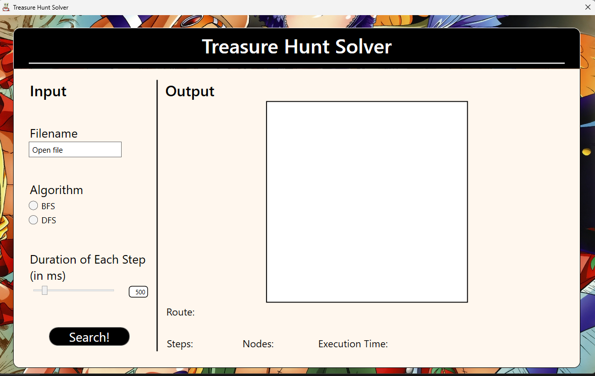
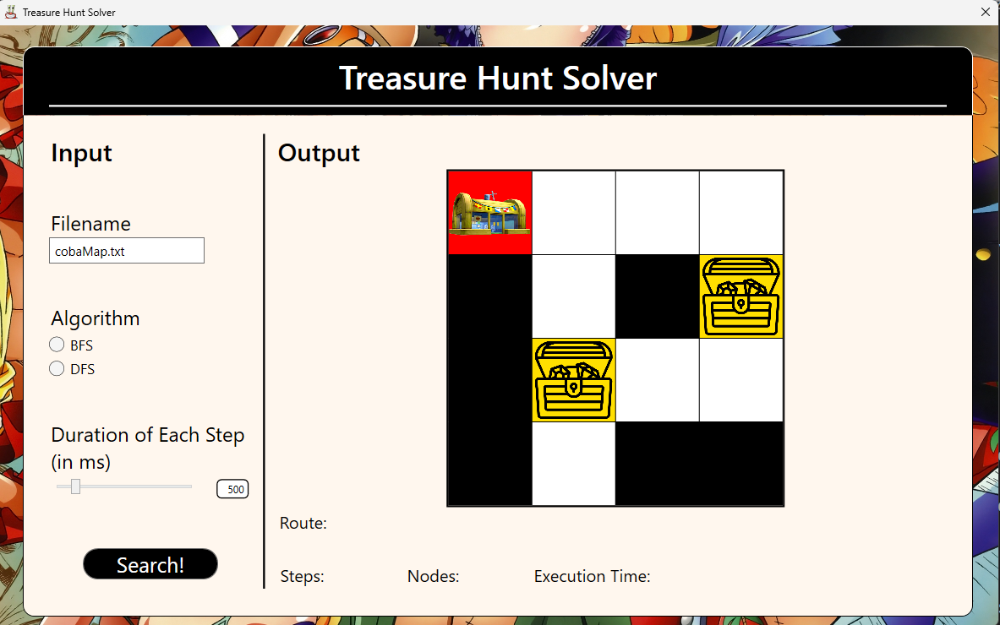
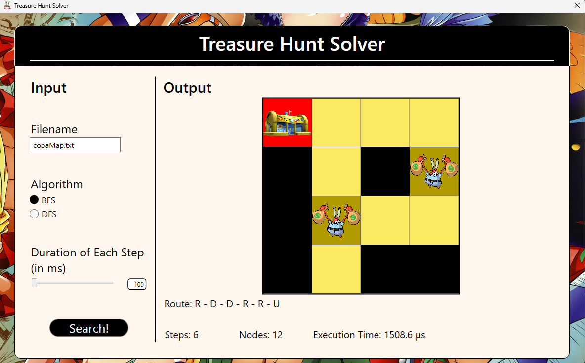

# Tubes2_sebut_kok_stu

Implementasi algoritma BFS dan DFS dalam program Treasure Hunt Solver untuk mencari rute pada sebuah labirin yang mendapatkan semua treasure pada labirin tersebut.

## Table of Contents

- [Tubes2\_sebut\_kok\_stu](#tubes2_sebut_kok_stu)
  - [Table of Contents](#table-of-contents)
  - [Aplikasi algoritma BFS dan DFS dalam Treasure Hunt Solver](#aplikasi-algoritma-bfs-dan-dfs-dalam-treasure-hunt-solver)
  - [Requirements](#requirements)
  - [How to compile](#how-to-compile)
  - [How to run](#how-to-run)
  - [Cara pemakaian program](#cara-pemakaian-program)
  - [Contoh Tampilan Program](#contoh-tampilan-program)
  - [Project Status](#project-status)

## Aplikasi algoritma BFS dan DFS dalam Treasure Hunt Solver

Implementasi algoritma graph traversal BFS dan DFS untuk menelusuri maze dan mendapatkan rute yang memperoleh semua treasure.

Algoritma BFS akan mencari rute dengan melihat kotak yang bertetangga terlebih dahulu baru kemudian menelusuri yang lain.

Algoritma DFS akan menelusuri satu jalur hingga tidak dapat ditelusuri baru akan menelusuri kotak yang lain.

## Requirements

1. Sistem operasi Windows dengan versi minimal Windows 7
2. .NET Framework dengan versi minimal 4.7.2

    Dapat di-install dari link berikut

    <https://dotnet.microsoft.com/en-us/download/dotnet-framework/net472>

3. .NET Core dengan versi minimal 7.

   Dapat di-install dari link berikut

   <https://dotnet.microsoft.com/en-us/download/dotnet/7.0>

## How to compile

Meng-clone repository ini dengan command (memerlukan git)

```shell
git clone https://github.com/RyanSC06/Tubes2_sebut_kok_stu.git
```

atau dapat men-download langsung dengan mengklik tombol Code dan download zip.

Kemudian program dapat di-compile dengan cara

1. Memasuki folder hasil cloning

    ```powershell
    cd  Tubes2_sebut_kok_stu   
    ```

2. Menjalankan command dotnet untuk meng-compile

    ```powershell
    dotnet build
    ```

Hasil compile program akan berada pada folder bin berupa file executeable.

## How to run

Program dapat dijalankan dengan dua cara

1. Menjalankan dari executeable yang sudah dibuat.

   Contohnya seperti berikut

   ```powershell
    .\bin\Debug\net7.0-windows10.0.17763.0\TreasureHuntSolver.exe    
   ```

2. Menggunakan command run dari dotnet.

    Pastikan berada pada root folder program. Jika sudah program dapat dijalankan dengan command

    ```powershell
    dotnet run
    ```

## Cara pemakaian program

1. Memilih file maze berupa .txt yang akan ditelusuri
2. Memilih algoritma BFS atau DFS
3. Klik search untuk memulai pencarian

Optional : mengubah kecepatan animasi dengan menggeser slider atau memasukkan angka kecepatan animasi dalam millisecond.

## Contoh Tampilan Program

1. Tampilan saat program pertama kali dibuka
    

2. Program menerima input file
    

3. Hasil pencarian rute dengan algoritma BFS
    

4. Hasil pencarian rute dengan algoritma DFS
    

## Project Status

Disusun Oleh :

Kelompok subet_kok_stu

- Yanuar Sano Nur Rasyid (13521110)
- Saddam Annais Shaquille (13521121)
- Ryan Samuel Chandra (13521140)

Project is: _complete_
